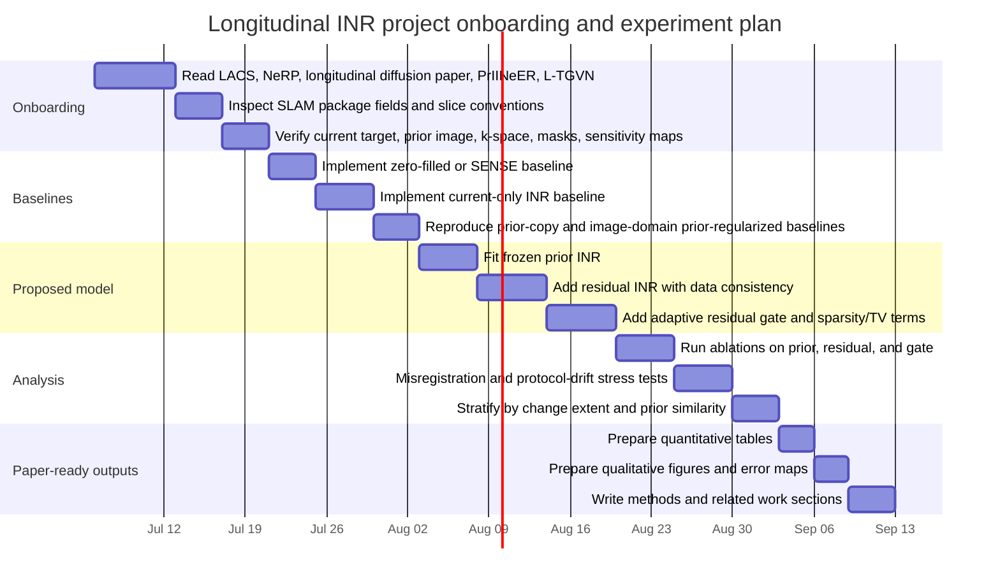

# Deep Research Report on Longitudinal MRI Reconstruction with a Frozen Prior INR and an Adaptive Residual Gate

## Executive summary

The most relevant literature splits into two partially overlapping streams. The first is **longitudinal MRI reconstruction with prior scans**, where the major themes are how to exploit a previous exam without copying it, how to handle imperfect registration, and how to remain robust to protocol differences across visits. The second is **scan-specific implicit neural representation reconstruction**, where the major themes are physics-based optimization from undersampled measurements and how to stabilize INRs at higher acceleration using stronger priors. The intersection of those two streams is still surprisingly thin. citeturn39view5turn41academia2turn40view0turn21academia2turn6view1

Your proposal already sits in an interesting place in that intersection: it fits an INR to a registered prior scan, freezes that network, and reconstructs the current scan as **prior anatomy plus a learned residual** from current undersampled k-space. That decomposition is clinically meaningful because it creates a dedicated pathway for interval change rather than forcing all information into a single prior-conditioned reconstruction. The adaptive residual gate you are now considering turns that idea into a stronger research question: not only **what changed**, but **where the prior should and should not be trusted**. fileciteturn0file0

The clearest gap is this: **existing longitudinal methods increasingly recognize prior bias, misregistration, and protocol drift, but they usually address those issues with large learned reconstruction systems or generic trust mechanisms rather than a patient-specific, scan-specific, explicitly decomposed INR that separates stable anatomy from change and exposes a spatial gate map.** Conversely, existing INR papers use priors, but the strongest public examples either use a generic prior embedding without longitudinal follow-up framing, or use population priors from pretrained models rather than a patient’s previous scan. That leaves room for a method whose novelty is not merely “use a prior with INR,” but specifically: **frozen patient-specific prior INR + sparse residual INR + adaptive gate + change-preservation evaluation**. citeturn41academia2turn30view2turn40view0turn6view1

One important source note: in the public indexed sources I found, the closest primary source for the dataset/workflow you refer to as **SLAM** is the longitudinal diffusion paper whose current arXiv title is **“Accelerating MRI with Longitudinally-informed Latent Posterior Sampling”**. That paper says it introduces an open-access clinical dataset with prior DICOMs and follow-up k-space, while your proposal explicitly names the resource as the **Stanford Longitudinally Accelerated MRI Dataset** and records metadata and split details from the packaged CSV. I did **not** find a separate indexed paper under the exact title “Stanford Longitudinally Accelerated MRI Dataset” or a separate indexed paper under the exact title “LAPS,” so in the report below I treat the public longitudinal diffusion paper as the closest public origin paper and your proposal as the best available source for the dataset package details you have in hand. citeturn40view0 fileciteturn0file0

## Field landscape and the target gap

A good mental model for the field is that it has moved through three stages. The older stage used **compressed sensing and weighted prior terms**, exemplified by LACS-MRI, which already recognized that follow-up scans can be similar but not identical and therefore used adaptive sampling and weighted reconstruction instead of blindly enforcing prior similarity. The next stage introduced **deep and generative priors** for longitudinal reconstruction, with PIPS framing the problem as diffusion-based posterior sampling from a prior-initialized latent state rather than as a strict image-domain regularization toward the old scan. The newest stage adds **trust-aware prior usage**, with L-TGVN explicitly naming temporal change, misalignment, and protocol drift as first-class problems and constraining the influence of the prior to remain consistent with current measurements. citeturn39view5turn40view0turn6view1

On the INR side, NeRP is the foundational paper you need to understand first. It showed that image reconstruction can be performed by optimizing an implicit representation from sparse measurements while embedding information from a prior image, without large paired training sets, and it explicitly argued that subtle changes needed for tumor progression assessment can still be captured. More recent INR work such as PrIINeER strengthens this family by injecting **population-level priors from pretrained reconstruction models** and enforcing **dual data consistency**, which substantially improves robustness at high acceleration. But that is still a different setting from yours: the “prior” in PrIINeER is a pretrained model’s prediction, not an earlier exam from the same patient. citeturn41academia2turn30view2

That leaves a narrow but meaningful gap. If you write the target method as

\[
\hat{x}(c)=f^{\text{prior}}_\theta(c)+g_\psi(c)\,\Delta_\phi(c),
\]

then each component maps onto a problem the literature cares about. The frozen prior INR \(f^{\text{prior}}_\theta\) addresses patient-specific stable anatomy; the residual path \(\Delta_\phi\) provides an explicit location for interval change; and the gate \(g_\psi\) addresses the trust problem that L-TGVN highlights. What appears to be missing from the public literature is a method that combines **all three in a scan-specific longitudinal INR framework** and then evaluates not only PSNR/SSIM but also whether the method preserves true change rather than regressing toward the prior. That is the clearest publishable gap. fileciteturn0file0 citeturn6view1turn41academia2turn30view2turn40view0

The strongest competitive pressure comes from two directions. From the longitudinal side, L-TGVN already claims trust guidance, measurement-consistent prior use, no explicit preregistration requirement, and accommodation of protocol drift. From the INR side, PrIINeER already claims that weak prior constraints are the main reason INR methods fail at high acceleration and answers that with prior-informed optimization and dual consistency. Your project should therefore avoid framing its novelty as simply “using priors with INRs.” It should instead frame its novelty as **patient-specific decomposition and change-aware gating**, ideally with ablations that show each of the following matters independently: frozen prior, residual branch, gate sparsity, and change-preservation evaluation. citeturn6view1turn30view2

## Prioritized reading map

The most efficient reading order is: **LACS-MRI → NeRP → the longitudinal diffusion paper associated with SLAM/PIPS → PrIINeER → L-TGVN**, then the adjacent papers on deformation/change and on engineering alternatives. This order moves from the original prior-bias problem, to INR reconstruction with prior embedding, to modern longitudinal baselines, to modern prior-informed INR design, and finally to the newest trust-aware longitudinal model. citeturn39view5turn41academia2turn40view0turn30view2turn6view1

| Priority | Paper | Why read it now | Primary source |
|---|---|---|---|
| Highest | Weizman, Eldar, Ben Bashat, **Compressed sensing for longitudinal MRI: An adaptive-weighted approach** | Classical statement of the prior-bias problem and the first adaptive longitudinal baseline. | citeturn14academia0turn39view5 |
| Highest | Shen, Pauly, Xing, **NeRP** | Closest conceptual ancestor for prior-informed scan-specific INR reconstruction. | citeturn41academia2turn29view0 |
| Highest | Urman et al., **Accelerating MRI with Longitudinally-informed Latent Posterior Sampling** | Closest public origin paper for the longitudinal clinical setting and the associated open-access paired-prior/k-space resource. | citeturn40view0turn5view0 |
| Highest | Al-Haj Hemidi et al., **PrIINeER** | Strongest public “INR + stronger prior” comparator. | citeturn6view0turn30view2 |
| Highest | Atalık, Chopra, Sodickson, **L-TGVN** | Closest direct competitor to the “adaptive trust/gate” story. | citeturn6view1turn31view0 |
| Medium | Renders et al., **DELTA-MRI** | Important because it treats longitudinal change estimation as a first-class objective. | citeturn1academia2 |
| Medium | Qiu et al., **ST-NeRP** | Not MRI reconstruction, but highly relevant for temporal INR thinking. | citeturn21academia1 |
| Medium | Shamaei et al., **Enhancing and Accelerating Brain MRI through Deep Learning Reconstruction Using Prior Subject-Specific Imaging** | Modern non-INR transformer/registration baseline for subject-specific prior use. | citeturn15academia2 |

**LACS-MRI — Lior Weizman, Yonina C. Eldar, Dafna Ben Bashat. Medical Image Analysis, 2015.** Methodologically, this is the classical prior-guided longitudinal MRI reconstruction paper: it uses the previous scan both during **sampling** and during **reconstruction**, adapting the strategy depending on how similar the repeated scan appears to be. The central idea is weighted compressed sensing rather than hard prior copying, and the paper is explicit that similarity between visits is useful but never guaranteed. The key equation to extract is the weighted CS objective with a prior-informed sparse-domain term; the key diagram is adaptive k-space sampling combined with weighted reconstruction. The data are 2D and 3D brain tumor MRI follow-up scans, and the paper reports a 3D Signal-to-Error Ratio of 24.8 dB at undersampling factor 16.6. Its strength is that it correctly identifies the danger of over-trusting the prior; its limitation is that it is registration-sensitive, hyperparameter-sensitive, and has no explicit learned change mechanism. It matters for your project because it is the baseline argument for why a residual branch and gate are needed at all. citeturn14academia0turn39view5

**NeRP — Liyue Shen, John Pauly, Lei Xing. IEEE Transactions on Neural Networks and Learning Systems, 2022.** NeRP proposes an implicit neural representation with **prior embedding** for sparse measurement reconstruction and emphasizes that no large paired training set is required. The paper’s central methodological move is to combine the physics of the sparse measurement operator with information internal to a prior image, so the INR does not optimize from measurements alone. The key equation/diagram to look for is the coordinate-based network conditioned by a prior embedding branch, rather than a simple unconditioned coordinate MLP. The abstract states that the method generalizes across CT and MRI and can capture subtle but important image changes relevant to tumor progression, which is very close to your clinical motivation. Its strength is conceptual closeness to your frozen-prior INR idea; its limitation is that it does not publicly present the exact longitudinal follow-up decomposition you want, and there is no explicit adaptive gate in the abstract-level description. It matters because it is the paper most reviewers will think of if you claim novelty around “prior-informed INR reconstruction.” citeturn41academia2turn29view0

**Urman, Shah, Kumar, Soares, Setsompop — Accelerating MRI with Longitudinally-informed Latent Posterior Sampling. arXiv, current public version 2025.** This paper is the closest public primary source for the longitudinal clinical setting you want. The public record says the method trains a diffusion model without needing longitudinally paired training examples, then **initializes inference from a prior scan in latent space** and applies data-consistency optimization during reverse diffusion. The key equation is the latent-space optimization of measurement consistency during posterior sampling, and the key architectural diagram is “encode prior → project to timestep \(t^p\) → reverse diffusion with DC at every step.” The public paper also says it introduces an open-access clinical dataset with multi-session pairs including prior DICOMs and follow-up k-space; the earlier version reports OASIS-3 plus a local hospital set, 12-coil simulated k-space, and evaluation split into **similar** and **dissimilar** patches to detect prior bias. Its strength is that it directly tackles misregistration and prior-bias evaluation; its limitation is that it is a heavy generative method rather than a simple scan-specific INR. It matters because it gives you both a strong comparator and a blueprint for change-aware evaluation. citeturn40view0turn5view0

**PrIINeER — Ziad Al-Haj Hemidi, Eytan Kats, Mattias P. Heinrich. BMVC 2025.** PrIINeER is one of the most important papers for your project because it directly states the INR problem you are likely to face: under high acceleration, INRs become unstable because they lack strong prior constraints. The method addresses this by integrating population-level prior knowledge from pretrained models into a scan-specific INR optimization and enforcing **dual data consistency** both with acquired k-space and with the prior-based reconstruction. The official repository shows multiple prior variants, including no-prior, UNet-prior, generative-INR-prior, and transformer-prior versions, which makes it especially useful as an implementation reference. The key equation to extract is the dual-constraint optimization objective; the key diagram is “pretrained prior model + per-instance INR + dual consistency.” The dataset is NYU fastMRI. Its strength is that it is probably the best public “strong prior for INR” comparator; its limitation is that the “prior” comes from pretrained models rather than a previous scan from the same patient, so it does not solve the true longitudinal trust problem. It matters because reviewers may see it as the most relevant non-longitudinal competing answer to weak INR priors. citeturn6view0turn30view0turn30view1turn30view2

**L-TGVN — Arda Atalık, Sumit Chopra, Daniel K. Sodickson. MICCAI 2026.** L-TGVN is the most direct recent competitor to the adaptive-gate story. Its abstract says the method leverages prior scans as side information but **constrains prior influence to remain consistent with acquired measurements**, does **not require explicit preregistration**, and can accommodate **protocol drift** across visits. The code repository describes it as a Longitudinal Trust Guided Variational Network implemented in PyTorch/Lightning and notes a slice-by-slice `.npz` data format with k-space and target, which is useful for practical onboarding. The key equation/diagram to extract is the trust-guided update rule within the variational network; the key conceptual diagram is “current measurements + prior side information + learned trust guidance.” Its strength is exactly the one you care about: measurement-aware trust of prior information under realistic longitudinal variation. Its limitation, from your perspective, is that it is not an INR and therefore does not provide the explicit patient-specific continuous decomposition your method can offer. It matters because it sets the bar for any claim about “where to trust the prior.” citeturn6view1turn31view0turn30view3

**DELTA-MRI — Jens Renders et al. arXiv, 2023.** DELTA-MRI is not an INR paper, but it is important because it reframes longitudinal MRI around **direct change estimation** from a reference image and subsampled k-space, rather than treating image reconstruction and change analysis as separate steps. Methodologically, it jointly estimates follow-up images and deformation vector fields, avoiding the conventional sequence of reconstruct → register → estimate change. The key diagram is therefore not a prior-regularized reconstructor but a joint reconstruction-and-change-estimation pipeline. Its strength is that it takes change seriously as part of the reconstruction target; its limitation is that the formulation is oriented toward deformation estimation rather than explicit patient-specific image decomposition. It matters because it supports the argument that your evaluation should include change-preservation, not just image fidelity. citeturn1academia2

**ST-NeRP — Liang Qiu et al. arXiv, 2024.** This is not a fast MRI reconstruction paper, but it is conceptually useful because it extends NeRP-style prior embedding into a spatial-temporal representation. The method uses an INR to encode the reference timepoint and another INR to learn a continuous deformation function across time, enabling prediction at arbitrary target timepoints. The key diagram is “reference-time embedding + temporal deformation INR,” and the key idea is that patient-specific change can be treated as a continuous function rather than as a discrete pairwise residual. Its strength is that it offers a principled temporal extension of prior-embedded INR thinking; its limitation is that it is demonstrated on CT series rather than on undersampled MRI reconstruction from k-space. It matters because it gives you conceptual support for later extensions such as time-interval-conditioned gates or deformation-aware residuals. citeturn21academia1

**Enhancing and Accelerating Brain MRI through Deep Learning Reconstruction Using Prior Subject-Specific Imaging — Shamaei et al. arXiv, 2025.** This is a useful engineering comparator even though it is not INR-based. The method combines an initial reconstruction network, a deep registration model, and a transformer-based enhancement network to use prior subject-specific scans while reducing the burden of classical registration. It was evaluated on a longitudinal T1-weighted dataset of 2,808 images from 18 subjects across acceleration factors R5, R10, R15, and R20, and the authors also checked the downstream effect on brain segmentation. Its strength is that it addresses registration directly and connects reconstruction quality to downstream analysis; its limitation is that it is a supervised, multi-component system rather than a compact scan-specific physics-based model. It matters because it shows what a modern prior-subject-specific non-INR baseline looks like in practice. citeturn15academia2

## Ramp-up file for a new researcher

The right starting point is the MRI forward model. MRI images are reconstructed from **k-space**, the Fourier-domain measurements acquired by receiver coils, not from direct pixel observations. In the single-image case, full k-space can be inverted with an inverse Fourier transform; in the multi-coil case, each coil measures a sensitivity-weighted version of the image, so the forward model is \(y_i=\mathcal F(S_i m)+\text{noise}\), and accelerated acquisition introduces a sampling mask \(M\) that leaves you with an inverse problem rather than a direct inversion. This is the reason most modern methods can be written as a data-consistency problem around an operator like \(\mathcal A(x)=MFSx\). citeturn35view0

For INRs, the practical takeaway is that a coordinate-based MLP is not just an image compressor. In MRI reconstruction, it becomes a **scan-specific implicit prior** optimized directly against the imaging physics. NeRP shows how a prior image can be embedded into such optimization, while PrIINeER shows why stronger priors are needed at higher accelerations, and SIREN/Fourier-feature work explains why naive coordinate networks need either periodic activations or positional encodings to represent higher-frequency structure stably. For your project, the safest default is a sine-activated INR or a ReLU MLP with Fourier features, because both are explicitly designed to reduce the low-frequency bias of vanilla MLPs. citeturn41academia2turn30view2turn38academia1turn37academia0

The longitudinal reconstruction problem adds three failure modes that matter more than generic MRI fidelity. The first is **prior bias**: a method that stays close to the old scan can look artificially good even when it suppresses clinically important interval change. The second is **misregistration**: prior-scans are rarely perfectly aligned, and methods that assume near-perfect alignment become brittle. The third is **protocol drift**: follow-up scans may use a different sequence, plane, or acquisition setting, so a model that treats the prior as identical context rather than related context can overfit across visits. These are not side issues; they are precisely the problems emphasized by LACS-MRI, the longitudinal diffusion paper, and L-TGVN. citeturn39view5turn40view0turn6view1

For the **SLAM dataset**, the public documentation appears incomplete in indexed sources, so use a two-level description. Publicly, the longitudinal diffusion paper says it introduces an open-access clinical dataset containing **multi-session pairs** with **prior DICOMs** and **follow-up k-space**, and it explicitly uses the prior scan in **magnitude DICOM form** at inference. In your project package, the proposal records metadata fields including `recon_path`, `ksp_path`, `prior_path`, `has_prior`, `change_extent`, `exam_interval`, `scan_type`, `Protocol`, `scan_plane`, and slice-index ranges, and it notes that the inspected training CSV contains 207 scans, of which 80 have priors and 127 do not. Treat the proposal as the operational source for splits and metadata, and treat the public diffusion paper as the closest public origin paper for the longitudinal acquisition idea. citeturn40view0 fileciteturn0file0

The implementation path I would recommend begins with a **strictly scan-specific, slice-wise baseline** before you touch 2.5D or 3D. Start from the exact decomposition already in your proposal,

\[
\hat{x}_{\text{current}}(c)=f^{\text{prior}}_\theta(c)+r^{\text{current}}_\phi(c),
\]

where \(f^{\text{prior}}_\theta\) is first fit to the registered prior image and then frozen, and \(r_\phi\) is trained from current undersampled k-space under data consistency. Then introduce the gate,

\[
\hat{x}_{\text{current}}(c)=f^{\text{prior}}_\theta(c)+g_\psi(c)\,\Delta_\phi(c),
\]

with \(g_\psi(c)\in[0,1]\). This upgrade is conceptually aligned with your proposal’s prior-plus-residual decomposition and with L-TGVN’s trust-guided prior usage, while remaining much simpler than a full variational network or latent diffusion pipeline. fileciteturn0file0 citeturn6view1

A good training recipe is to **separate representation learning of the prior from reconstruction of the current scan**, and only then learn the gate jointly with the residual. Stage one fits \(f^{\text{prior}}_\theta\) to the registered prior image with an image-space L1 or Charbonnier loss; a width-256, 4–6 layer INR with sine activations or Fourier features is a sensible starting point. Stage two freezes the prior INR and jointly optimizes \(\Delta_\phi\) and \(g_\psi\) against current k-space measurements using a data-consistency objective of the form \(\|MFS\hat{x}-y\|_2^2\), plus regularizers that keep the gate sparse and smooth and the effective residual small. A practical objective is

\[
\mathcal L
=
\|MFS\hat{x}-y\|_2^2
+\lambda_\Delta \|g_\psi\Delta_\phi\|_1
+\lambda_g \|g_\psi\|_1
+\lambda_{\text{tv}} TV(g_\psi).
\]

This exact formulation is a recommendation rather than a copy from one prior paper, but it is directly motivated by your proposal’s residual reconstruction framework and by the trust-guided prior literature. fileciteturn0file0 citeturn6view1turn39view5

For initialization, avoid two common mistakes. Do **not** initialize the gate at exactly zero, because then the residual path receives almost no gradient. And do **not** make the residual branch too expressive too early, because then it can relearn the whole image and bypass the prior. A good practical starting point is to parameterize \(g_\psi(c)=\sigma(a_\psi(c)-b)\) with a negative bias \(b\) so that the gate starts mostly closed, and to use a slightly smaller residual network than the prior network. If convergence is unstable, use a short warm start in which the residual is trained with \(g=1\) for a small number of iterations before turning on gate sparsity; if the gate becomes uninterpretable, constrain the residual amplitude with a bounded output such as \(\Delta_\phi=A\tanh(\tilde\Delta_\phi)\). These are recommended engineering choices, but they are consistent with the trust-guided design logic emerging in the newest longitudinal work. citeturn6view1turn38academia1turn37academia0

The baseline suite should be wide enough to isolate the contribution of every design choice. At minimum, I would include: a simple zero-filled or SENSE-style reconstruction; a current-only INR with no prior; a prior-copy baseline; LACS-style image-domain prior regularization if practical; a NeRP-style prior-embedded INR baseline; a PrIINeER-style external-prior INR baseline if code integration is feasible; and L-TGVN if reproduction is realistic. The strongest ablations are not “our method vs everything else,” but **current-only INR vs prior+residual vs prior+residual+gate**, plus gate sparsity sweeps, misregistration stress tests, and protocol-mismatch subsets. citeturn39view5turn41academia2turn30view2turn6view1

Evaluation has to go beyond PSNR and SSIM. The longitudinal diffusion paper’s similar-vs-dissimilar patch evaluation is one of the best available public ideas because it prevents “copy the prior” methods from scoring well simply by matching unchanged anatomy. Your proposal adds two even more targeted quantities: **change preservation error** and a **prior bias score** defined relative to the difference between the reference current scan and the prior. Use both. In addition, stratify every result by `change_extent` if that metadata is available in the SLAM package, because a method that performs well when nothing changes can still be clinically unsafe when pathology evolves. citeturn5view0turn40view0 fileciteturn0file0

My recommended reporting protocol is therefore: standard image metrics on the current target reconstruction; patch-grouped similar/dissimilar metrics in the style of the longitudinal diffusion paper; change-preservation metrics from your proposal; and failure-case panels on misregistration, protocol mismatch, and large-change cases. Also report calibration-like summaries for the gate, such as mean gate value inside high-change vs low-change regions or high-correlation vs low-correlation patches. If your gate is meaningful, it should not just improve metrics; it should visibly open in places where the prior is less reliable. citeturn40view0 fileciteturn0file0

## Comparison tables

The first table compares representative methods against the specific design choices your project cares about most.

| Method | Prior usage | INR | Explicit residual branch | Explicit gate / trust map | Multi-coil status in primary source | Datasets highlighted in primary source | Main loss / inference idea | Reported metrics or result framing | Why it matters here |
|---|---|---:|---:|---:|---|---|---|---|---|
| LACS-MRI | Previous scan used in adaptive sampling and weighted reconstruction | No | No | No | Not clearly stated in abstract summary | 2D and 3D brain tumor MRI follow-up | Weighted CS with adaptive sampling and prior-informed sparse-domain weighting | SER reported; longitudinal similarity-aware reconstruction quality | Classical longitudinal baseline and prior-bias precursor. citeturn14academia0turn39view5 |
| NeRP | Prior image embedded into scan-specific reconstruction | Yes | Not explicit | No | MRI supported, coil setup not explicit in abstract | CT and MRI demonstrations | Physics-constrained INR with prior embedding | Change robustness emphasized, including tumor progression setting | Closest conceptual ancestor on the INR side. citeturn41academia2turn29view0 |
| Longitudinally-informed Latent Posterior Sampling | Prior scan used to initialize latent posterior sampling | No | No | Implicitly yes, through measurement-consistent diffusion guidance, but no explicit spatial gate map | Public paper reports simulated 12-coil k-space in one evaluation setup | OASIS-3, local hospital longitudinal pairs, and an open-access clinical paired-prior/k-space dataset | Reverse diffusion with data consistency and prior latent hot start | PSNR/SSIM, similar-vs-dissimilar patch analysis, robustness to change/misregistration | Strongest public longitudinal benchmark and closest public SLAM-origin source. citeturn5view0turn40view0 |
| PrIINeER | Prior comes from pretrained deep reconstruction models | Yes | No | No | fastMRI-based; exact coil setting should be verified in implementation | NYU fastMRI | Instance-specific INR + prior-guided supervision + dual data consistency | Standard quantitative reconstruction comparisons; abstract claims improvement over INR and learned baselines | Strongest public prior-informed INR baseline. citeturn6view0turn30view2 |
| L-TGVN | Prior scan used as side information with trust guidance | No | Not explicit | Yes | Repo expects slice-wise k-space `.npz`; exact coil configuration not explicit in abstract | In-house longitudinal data in public repo notes | Trust-guided variational network with measurement-consistent prior influence | Standard quantitative metrics and fine-structure preservation at high acceleration | Closest direct competitor to an adaptive gate story. citeturn6view1turn31view0turn30view3 |
| DELTA-MRI | Reference image used to estimate follow-up and deformation jointly | No | Change/deformation is central | Not framed as gate | Not explicit in abstract | Longitudinal MRI with subsampled k-space | Joint estimation of images and deformation fields | Normalized reconstruction error improvements | Supports change-aware framing. citeturn1academia2 |
| Proposed project | Previous registered scan fit by frozen patient-specific INR | Yes | Yes | Yes | Yes in project plan | SLAM package in hand, prior-available subset first | \( \|MFS\hat{x}-y\|_2^2+\lambda_\Delta\|g\Delta\|_1+\lambda_g\|g\|_1+\lambda_{tv}TV(g) \) | PSNR/SSIM/NMSE plus change-preservation and prior-bias metrics | Targets the missing combination of patient-specific prior INR, explicit change path, and trust gating. fileciteturn0file0 |

The second table is a practical setup sheet for onboarding and first experiments.

| Topic | Recommended starting point | Why this is the safest default |
|---|---|---|
| Data scope | Start with prior-available cases only, 2D slice-wise, central informative slice range. | This matches your proposal’s staged plan and avoids confounding early debugging with missing-prior cases or 3D memory complexity. fileciteturn0file0 |
| Image parameterization | SIREN INR or Fourier-feature MLP, 4–6 layers, width 256 for prior branch. | Periodic activations and Fourier features are designed to fit high-frequency coordinate signals more reliably than plain MLPs. citeturn38academia1turn37academia0 |
| Residual branch | Slightly smaller than prior branch, for example width 128–256. | A smaller residual discourages relearning the whole image and preserves the meaning of the frozen prior. This is a design recommendation supported by the prior-bias logic of longitudinal work. citeturn39view5turn6view1 |
| Gate branch | Shallow coordinate MLP with sigmoid output and negative bias initialization. | Starting mostly closed encourages the model to trust the prior unless k-space evidence opens the gate. citeturn6view1 |
| Stage one loss | L1 or Charbonnier image fitting on the registered prior image. | Robust image-space prior fitting is enough; stage one is not the place to solve the inverse problem again. fileciteturn0file0 |
| Stage two loss | Data consistency + residual sparsity + gate sparsity + gate TV smoothing. | This is the cleanest way to couple measurement fidelity with selective prior usage. fileciteturn0file0 citeturn6view1 |
| Complex data handling | Best long-run version: reconstruct complex current image, treat prior magnitude as anatomical anchor only; early prototype may evaluate magnitude output first. | Your proposal already notes the magnitude-prior versus complex-k-space mismatch, so this should be treated as an explicit engineering decision, not an accident. fileciteturn0file0 |
| Baselines | Zero-filled/SENSE, prior copy, current-only INR, LACS-style prior regularizer, NeRP-style prior embedding, PrIINeER-style external prior, L-TGVN if feasible. | This isolates benefits from patient-specific priors, explicit residuals, and gates. citeturn39view5turn41academia2turn30view2turn6view1 |
| Core ablations | Remove prior, remove residual, remove gate, vary gate sparsity, misregister prior deliberately, protocol-mismatch subset. | The claims you want to make are exactly about trust, change, and robustness; the ablations should mirror those claims. citeturn40view0turn6view1 |
| Main evaluation | PSNR, SSIM, NMSE/HFEN if available, similar-vs-dissimilar patch metrics, change-preservation error, prior-bias score, stratification by `change_extent`. | Standard reconstruction metrics alone are not enough for longitudinal safety. citeturn5view0turn40view0 fileciteturn0file0 |

## Onboarding timeline and suggested figures

A realistic first-pass onboarding and experiment sequence is below. It is intentionally structured so that every stage produces something publishable or at least diagnosable: first reproducible data loading, then prior fitting, then current-only INR, then prior+residual, then prior+residual+gate, and only then misregistration/protocol-drift stress tests.

The most valuable figures for the ramp-up file and later paper are the ones that make the longitudinal claim visual rather than abstract. I would include: a **forward-model figure** showing multi-coil k-space, sensitivity maps, and the \(MFS\) operator; a **method figure** showing prior INR, residual INR, gate, and data consistency; a **prior-bias failure panel** comparing prior copy, current-only INR, prior+residual, and prior+residual+gate on a real change case; a **gate visualization panel** overlaying \(g_\psi(c)\) on the reconstructed image; a **difference-map panel** comparing \(\hat{x}-x_{\text{prior}}\) to \(x_{\text{ref}}-x_{\text{prior}}\); and a **robustness panel** showing deliberate misregistration or protocol mismatch. These figures would directly support the literature gap you are trying to claim: the method should not just reconstruct better, it should visibly learn where not to trust the prior. citeturn40view0turn6view1 fileciteturn0file0

If you want only a single-sentence positioning statement for the project after reading this literature, it should be this: **we are not proposing yet another prior-informed INR; we are proposing a patient-specific, change-preserving longitudinal reconstruction model that decomposes current anatomy into frozen prior structure and gated residual change, and then evaluates whether that gate actually prevents clinically dangerous prior bias.** fileciteturn0file0 citeturn41academia2turn30view2turn6view1turn40view0